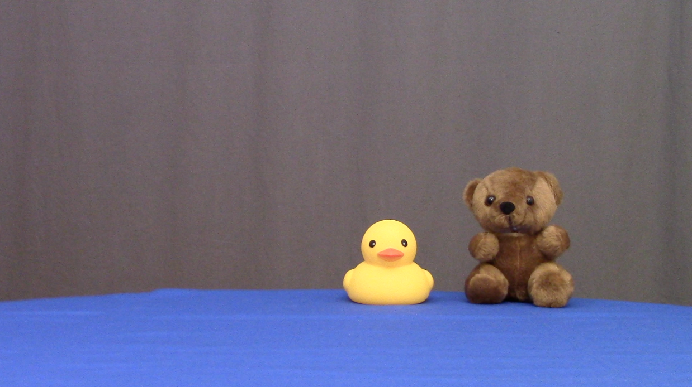
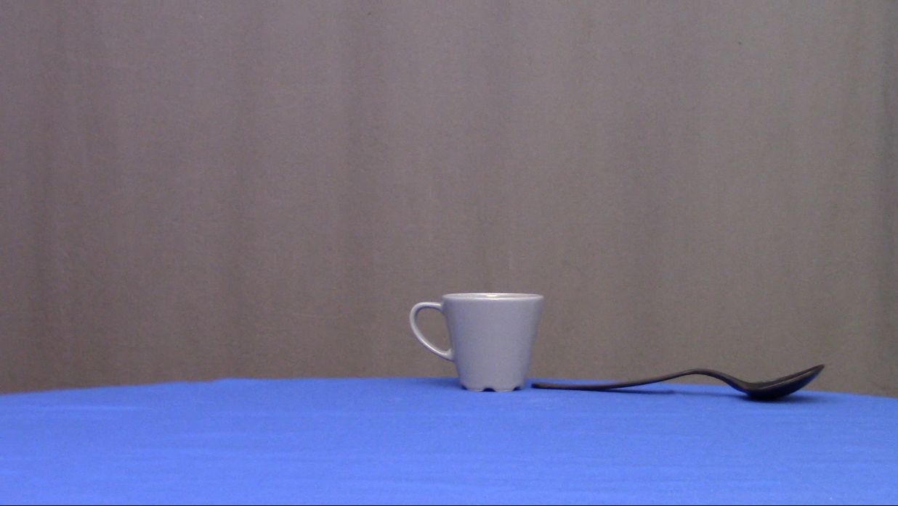

```{r setup, include=FALSE}
knitr::opts_chunk$set(echo = TRUE)
```

This pilot study addresses the following main question: At what age do toddlers understand negation in the context of rejection? We plan to extend this paradigm to test negation in the context of denial and non-existence in the future.

## Design Summary

The study presents toddlers with videos and measures their looking time to the screen in a violation of expectation paradigm [@baillargeon1985object]. In each trial, there are two puppets and two objects on the screen. One puppet asks the other if they want one of the objects. The second puppet answers with "yes" or "no". Then the first puppet gives either the desired object (consistent with the answer), or the object that was not desired (inconsistent with the answer). We hypothesize that knowledge of negation in the context of rejecting desires results in surprise when the puppet provides a rejected object.

The study has four within-subject trial types. These four trial-types are created based on two factors:

1. Negation: Whether the answer to the question is positive (yes) or negative (no)
2. Consistency: Whether the desired or the rejected object is given 

The table below summarizes the study's $2\times2$ design. Positive trial types consititue the control condition and negative trial types constitute the test condition. 

|Trial-Type|Objects|Question|Answer|Object Received|
|-----|-------|-------|-----|-------|
|Positive-Consistent|X, Y| Do you want the X?| Yes| X|
|Negative-Consistent|X, Y| Do you want the X?| No| Y|
|Positive-Inconsistent|X, Y| Do you want the X?| Yes| Y|
|Negative-Inconsistent|X, Y| Do you want the X?| No| X|

## Stimuli

### Puppets

The study had two puppets: Yuni the unicorn and Diego the Dragon. Yuni is the puppet that receives objects and Diego is the puppet that asks Yuni what she wants and gives her an object.

{width=50%}

### Objects

We used four pairs of objects (one per trial type): 1. an apple and a banana, 2. a small ball and a toy car, 3. a rubber duck and a teddy bear 4. a cup and a spoon.

{width=50%}
{width=50%}
{width=50%}
{width=50%}

### Words

This study used the following words in its test trials: *no*, *yes*, *do*, *you*, *want*, *the*, *apple*, *banana*, *ball*, *car*, *duck*, *bear*, *cup*, and *spoon*. This section provides evidence that the majority of children between 24 and 30 months are faimilar with these words. We used the MacArthur-Bates Communicative Development Inventory (MB-CDI), accessed via (wordbank.stanford.edu)[wordbank.stanford.edu] [@frank2017wordbank], and children's productions in CHILDES, accessed via (childes-db.stanford.edu)[childes-db.stanford.edu]. CDI data is indirect parents' reports on children's vocabulary development while CHILDES data is recordings of children producing the words directly.

{width=50%}

According to CDI data, around 27 months of age almost all children produce "yes" and "no". The names for all of the objects used are produced by more than 75% of children at 27 months, and are among the first nouns that children produce, as reported by parents (wordbank.stanford.edu). Additionally, @bergelson2012 and @bergelson2015early  provide good evidence that children understand common nouns long before they begin to produce them (as early as 6-9 months). 

{width=50%}

The remaining words used in the study (do, you, want, the) are clustered around 50% in terms of production at 27 months, and that proportion is increasing rapidly at that age, as seen in the graph. There was no data for the word 'want', so 'want to/wanna' has been taken as a proxy under the assumption that production of 'want' is at least as high as production of 'want to'. 

We also looked at children's productions of these words in CHILDES. The graph below shows that all the words in our experiment are produced in the second and third year of children's lives, the same age range that our experiment targets. 

{width=50%}


{width=50%}
{width=50%}

{width=50%}

### Video and Audio Recording/Editing

Videos were recorded in a video recording room using a X camera. Objects were placed on a round table covered with a blue table cloth and puppets were controlled from under the table. There were a total of 21 raw video recordings: 1 puppet introduction video, 4 object introduction videos, and 16 test trial videos (4 videos per trial-type). In the four test trial videos for each trial type, we varied the position of the objects (left vs. right) and which object was given to Yuni. Movements of the puppets including their mouth movements were timed using a metronome to stay consistent across trials. Videos were edited using Apple Mac OS's iMovie. No special or complex effects were used so any other video editing software can accomplish the same task. All the videos had the same length of 24 seconds. 

Audio stimuli were recorded separately in a phonetics lab's recording studio and added to the videos. The first author acted as the voice of Diego and the second author as the voice of Yuni. For Diego the recordings included: "Hi Yuni", "Alright", and 8 utterances of "Do you want the X?" where X was the lable of one of the objects. For Yuni, the recordings included "yes" and "no". Each video had a positive version in which "yes" was edited over on Yuni's mouth movements and a negative version that had "no" insetead. It also had a two versions for which object Diego asked for. In total, there were 64 test trial videos and 5 introduction videos used in the experiment. All video and audio stimuili are available for inspection in the stimuli folder of this study's repository.

## Procedure

The study started with the puppets entering the scene and introducing themselves. After this introduction video children saw 12 videos in 4 blocks. Each block had 3 trials: one introduction video to the objects followed by two test trials.

### Design


The figure below shows the study design, randomization, and procedure. From left to right, it shows the elements that were randomized, the experiental blocks, and example trials within blocks. For each participant, object pairs were assigned randomly to the four blocks and counterbalanced across participants. In the figure above, the pair apple-banana is assigned to the first block, ball-car to the second, cup-spoon to the third, and duck-bear to the fourth. Within each block, children first saw a video introducing and labeling the objects. Then they saw two trials which only differed with respect to the position of the objects on the screen. For each block, it was randomly decided which object label is going to be used to form the question "Do you want X?".

The first experimental block was always the positive-consistent block in which Diego asked if Yuni wants an object, Yuni said "yes", and Diego gave Yuni the object. The second block was always the negative-consistent block: Diego asked if Yuni wants an object, Yuni said "no", so Diego gave Yuni the other object. Previous research has shown that in experimental settings, comprehension is better scaffolded in toddlers if negative trials follow positive ones and not vice versa. After the second block, participants randomly saw one of the positive or negative inconsistent blocks, followed by the other. The inconsistent blocks were randomized to reduce possible systmatic decrease of looking times in the fourth block due to famliarity with Diego's inconsistent behavior.

## Participants

@csibra2016statistical report that the average effect size in infant looking time studies is about 0.6. Based on this they recommend at least 12 participants and for smaller than usual effect sizes at least 26 participants. Therefore, for our pilot study we aimed at recruiting between 12-26 participants in the age range of 24-30 months. All participants were monolingual; they were only exposed to English.

## Measurment

Our dependent measure was the duration of infant's looking at the screen after a trial video had ended. All trials ended with the last frame frozen on the screen. We moved to the next trial if infants stopped looking at the screen for more than 2 seconds. Timing, trial ordering, and presentation were managed using the open source software 
[PyHab developed by Jonathan Kominsky](https://github.com/jfkominsky/PyHab/releases).

The stimuli were controlled by the experimenter, unaware of the stimuli but with a live feed of the child. The experimenter coded the child's looking time by pressing a key when the child was looking at the screen and releasing when the child looked away. Each trial ended when the last frame was showing and the experimenter had indicated that the child had been looking away from the screen for 2 seconds.

### Reliability

Trial data provided by each participant were recoded by an independent coder unaware of the stimuli and the experimental hypotheses. The coder used the pyHab software and relibaility was computed as the intraclass correlation coefficient (ICC). We determined that ICC should be above 0.75, a threshold which constitutes excellent agreement [@cicchetti1994guidelines]. 

## Results and Analyses

Assuming that toddlers understood the basics of our task, as well as the meaning of the words used including "yes" and "no", we predicted that:

  1. Toddlers will look longer at inconsistent trials than consistent ones (main effect).
  2. Toddlers will look longer at negative inconsistent trials than positive ones (interaction).

To verify these predictions we use a Bayesian mixed effects linear regression with the fixed effects of consistency (consistent/inconsistent) and negation (yes/no). These factors will be dummy coded with the intercept of the model as positive consistent trials. Following @barr2013random, we use the maximal by subject and item random effects allowed by our design. Following @csibra2016statistical, we log-transform the infant looking time for our statistical analyses.

$log(lookingTime_{ij}) \sim \alpha + \beta_{inconsistent} \times consistency + \beta_{negative} \times negation + \beta_{incons.neg}\times negation \times consistency + \beta_{order}\times trialOrder$

We predict that successful comprehension in our tasks results in positive model estimates for the following coefficients: $\beta_{inconsistent}$ and $\beta_{incons.neg}$, and estimates distributed around 0 for $\beta_{negative}$. We will also include per subject and item random intercepts and slopes.

## Alternative Accounts

Here we discuss the alternative accounts of children's behavior. First we consider the label-object matching account. Children may only track which object label was mentioned and which object was provided. The prediction is that children look longer if an object other than the one mentioned was provided. This results in increased looking time for positive inconsistent and negative consistent trials. Another possibility is that children will be simply surprised by negation and look longer at negative trials. The prediction is that they look longer at negative trials.

## Discussion

Based on the pilot study, we plan to make changes to our materials and design to improve it for the final version of the study. The changes will be reflected in the final study's methods description and will be pre-registered before data collection.

## References

